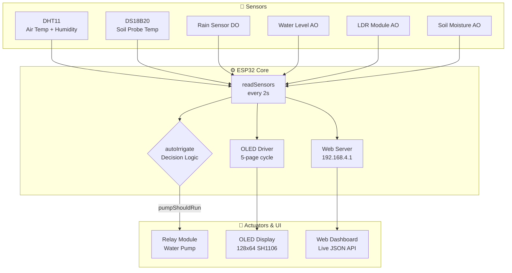

<div align="center">


<br/><br/>

```
     ██╗██╗ ██████╗ ██╗   ██╗ █████╗ ███████╗██╗   ██╗
     ██║██║██╔════╝ ╚██╗ ██╔╝██╔══██╗██╔════╝██║   ██║
     ██║██║██║  ███╗ ╚████╔╝ ███████║███████╗██║   ██║
██   ██║██║██║   ██║  ╚██╔╝  ██╔══██║╚════██║██║   ██║
╚█████╔╝██║╚██████╔╝   ██║   ██║  ██║███████║╚██████╔╝
 ╚════╝ ╚═╝ ╚═════╝    ╚═╝   ╚═╝  ╚═╝╚══════╝ ╚═════╝
```

### 🌱 Smart Irrigation System
**Learning by Doing — ESP32 + 6 Sensors + OLED + Local Web Dashboard**

[📖 Documentation](#-table-of-contents) · [⚡ Quick Start](#-quick-start) · [🔌 Wiring](#-pin-mapping) · [🌐 Web UI](#-web-dashboard) · [🤝 Contributing](#-contributing)

</div>

---

## 📋 Table of Contents

- [Overview](#-overview)
- [Features](#-features)
- [System Architecture](#-system-architecture)
- [Hardware Requirements](#-hardware-requirements)
- [Pin Mapping](#-pin-mapping)
- [Software Dependencies](#-software-dependencies)
- [Quick Start](#-quick-start)
- [Calibration Guide](#-calibration-guide)
- [Irrigation Logic](#-irrigation-logic)
- [Web Dashboard](#-web-dashboard)
- [OLED Display](#-oled-display)
- [API Reference](#-api-reference)
- [Configuration Reference](#-configuration-reference)
- [Troubleshooting](#-troubleshooting)
- [Contributing](#-contributing)
- [License](#-license)

---

## 🌿 Overview

**Jigyasu** is a fully offline, self-contained smart irrigation controller built on the **ESP32 NodeMCU Type-C**. It fuses data from six sensors to make autonomous, intelligent watering decisions — no internet, no cloud, no subscription.

The pump activates only when **all four safety conditions pass simultaneously**. Every decision is visible in real-time on the OLED display and on a responsive web dashboard served directly from the ESP32 over its own Wi-Fi hotspot.

> **Jigyasu** (जिज्ञासु) — Sanskrit for *"one who is curious to learn."*
> This project was built as a hands-on journey through embedded systems, sensor fusion, and IoT design.

---

## ✨ Features

| Category | Details |
|---|---|
| 🌡️ **Sensing** | DHT11 (air), DS18B20 probe (soil/water), Rain DO, Water Level AO, LDR, Soil Moisture AO |
| 🧠 **Decision Engine** | 4-condition guard: soil dryness + tank level + rain + probe temperature |
| 📟 **OLED UI** | 5-page auto-cycling dashboard with progress bars and pump indicator |
| 🌐 **Web Dashboard** | Responsive, auto-refreshing UI at `192.168.4.1` — no app needed |
| 📡 **REST API** | `/api/data` JSON endpoint for external integrations |
| 📴 **Offline-first** | Full AP mode — works in fields, greenhouses, anywhere |
| ⚙️ **Configurable** | All thresholds and calibration values as named constants |
| 🔒 **Safe** | Pump blocked during rain, high temperature, or empty tank |

---

## 🏗 System Architecture



---

## 🛒 Hardware Requirements

<details>
<summary><b>📦 Full Bill of Materials (click to expand)</b></summary>

<br/>

| # | Component | Spec | Qty | Notes |
|---|---|---|---|---|
| 1 | ESP32 NodeMCU | Type-C, 38-pin | 1 | Any ESP32 DevKit works |
| 2 | DHT11 | 3-pin module | 1 | DHT22 = higher accuracy |
| 3 | DS18B20 | Waterproof probe | 1 | Requires 4.7kΩ pull-up |
| 4 | Rain Sensor | DO output module | 1 | Adjust onboard pot for sensitivity |
| 5 | Water Level Sensor | AO output | 1 | Submerge in tank |
| 6 | LDR Module | AO output | 1 | Measure ambient light |
| 7 | Soil Moisture Sensor | AO output | 1 | Capacitive preferred over resistive |
| 8 | OLED Display | SH1106 1.3" 128×64 I²C | 1 | SSD1306 needs library swap |
| 9 | Relay Module | 5V, active-low, 1-channel | 1 | Optocoupler-isolated recommended |
| 10 | Water Pump | 3–6V DC or 5V USB | 1 | Match to relay rating |
| 11 | Resistor | 4.7 kΩ | 1 | DS18B20 pull-up to 3.3V |
| 12 | Breadboard + Jumpers | — | — | For prototyping |
| 13 | Power Supply | 5V 2A USB-C | 1 | Enough headroom for pump |

</details>

---

## 🔌 Pin Mapping

```
╔══════════════════════╦═══════════╦═════════════════════════════════╗
║  Component           ║  GPIO     ║  Notes                          ║
╠══════════════════════╬═══════════╬═════════════════════════════════╣
║  DHT11 Data          ║  GPIO  4  ║  Internal pull-up sufficient    ║
║  DS18B20 Data        ║  GPIO  5  ║  4.7kΩ pull-up → 3.3V required ║
║  Rain Sensor DO      ║  GPIO 34  ║  Input-only pin                 ║
║  Water Level AO      ║  GPIO 32  ║  ADC1 channel                   ║
║  LDR AO              ║  GPIO 33  ║  ADC1 channel                   ║
║  Soil Moisture AO    ║  GPIO 35  ║  Input-only pin                 ║
║  Relay IN            ║  GPIO 26  ║  Active-LOW (pump ON = LOW)     ║
║  OLED SDA            ║  GPIO 21  ║  I²C default on ESP32           ║
║  OLED SCL            ║  GPIO 22  ║  I²C default on ESP32           ║
╚══════════════════════╩═══════════╩═════════════════════════════════╝
```

> [!WARNING]
> GPIO 34 and GPIO 35 are **input-only** on the ESP32. Do not attempt to drive them as outputs or attach pull-up resistors controlled by the ESP32.

> [!NOTE]
> The DS18B20 **requires** a 4.7 kΩ resistor between the DATA line and 3.3V. Without it, the sensor will return garbage values or fail to be detected.

---

## 📦 Software Dependencies

Install all via **Arduino Library Manager** (`Sketch → Include Library → Manage Libraries`):

| Library | Author | Purpose |
|---|---|---|
| `DHT sensor library` | Adafruit | DHT11 / DHT22 driver |
| `Adafruit Unified Sensor` | Adafruit | Required by DHT library |
| `DallasTemperature` | Miles Burton | DS18B20 driver |
| `OneWire` | Jim Studt | 1-Wire bus protocol |
| `U8g2` | olikraus | SH1106 OLED driver |
| `ArduinoJson` | Benoit Blanchon | JSON serialization for API |

> [!NOTE]
> `WiFi` and `WebServer` are part of the **ESP32 Arduino Core** — install it via Board Manager if not already present: `https://raw.githubusercontent.com/espressif/arduino-esp32/gh-pages/package_esp32_index.json`

---

## ⚡ Quick Start

### Step 1 — Clone the repository

```bash
git clone https://github.com/<your-username>/jigyasu-irrigation.git
cd jigyasu-irrigation
```

### Step 2 — Install the ESP32 board

In Arduino IDE: **File → Preferences → Additional Board Manager URLs**, add:

```
https://raw.githubusercontent.com/espressif/arduino-esp32/gh-pages/package_esp32_index.json
```

Then: **Tools → Board → Board Manager** → search `esp32` → Install.

### Step 3 — Install libraries

**Sketch → Include Library → Manage Libraries**, search and install each library from the [table above](#-software-dependencies).

### Step 4 — Open and configure

Open `jigyasu_irrigation.ino`. Optionally change Wi-Fi credentials:

```cpp
const char* AP_SSID = "JigyasuIrrigation";  // Your SSID
const char* AP_PASS = "jigyasu123";          // Min 8 characters
```

### Step 5 — Flash

```
Board   : ESP32 Dev Module
Upload Speed : 921600
Port    : your COM / ttyUSB port
```

Click **Upload** ⬆️

### Step 6 — Connect

```
📶  SSID : JigyasuIrrigation
🔑  Pass : jigyasu123
🌐  URL  : http://192.168.4.1
```

Open your browser, navigate to `http://192.168.4.1` and the live dashboard appears.

---

## 🎛 Calibration Guide

<details>
<summary><b>🌱 Soil Moisture Calibration (important — do this first)</b></summary>

<br/>

Every soil sensor behaves differently. You must find your sensor's actual ADC range.

**Step 1** — Open Serial Monitor at `115200` baud after flashing.

**Step 2** — Note the `Soil: RAW=` value when the sensor is in **completely dry air**. This is your `SOIL_RAW_DRY`.

**Step 3** — Submerge the sensor tip in **clean water**. Note the `RAW=` value. This is your `SOIL_RAW_WET`.

**Step 4** — Update in code:

```cpp
// ==================== CALIBRATION ====================
#define SOIL_RAW_WET    1500   // ← replace with YOUR wet reading
#define SOIL_RAW_DRY    3500   // ← replace with YOUR dry reading
```

**Typical ranges:**
| Sensor Type | Dry (air) | Wet (water) |
|---|---|---|
| Resistive (cheap) | 3000–4095 | 300–800 |
| Capacitive (recommended) | 2800–3500 | 1200–1800 |

</details>

<details>
<summary><b>⚙️ Pump & Safety Thresholds</b></summary>

<br/>

```cpp
// Pump turns ON when soil moisture % falls below this
#define SOIL_DRY_PCT_THRESHOLD    30     // 0–100 %

// Tank is considered empty if ADC is below this
#define WATER_EMPTY_THRESHOLD    500     // raw ADC (0–4095)

// Pump blocked if DS18B20 reads above this (°C)
#define DS18B20_HOT_THRESHOLD    35.0    // degrees Celsius
```

</details>

---

## 🧠 Irrigation Logic

The pump turns **ON** only when **all four conditions are satisfied simultaneously**:

```
┌─────────────────────────────────────────────────┐
│              PUMP ACTIVATION GATE               │
├─────────────────────────────────────────────────┤
│  ✅  soilMoisturePct  <  SOIL_DRY_PCT_THRESHOLD │  Soil is dry
│  ✅  waterLevelRaw    >  WATER_EMPTY_THRESHOLD   │  Tank has water
│  ✅  rainDetected     == false                   │  Not raining
│  ✅  probeTemp        ≤  DS18B20_HOT_THRESHOLD   │  Water not too hot
├─────────────────────────────────────────────────┤
│  ALL TRUE → Pump ON    ANY FALSE → Pump OFF     │
└─────────────────────────────────────────────────┘
```

**Failure reasons shown on dashboard:**

| Condition failed | Message shown |
|---|---|
| Soil is wet | `→ Soil moisture adequate` |
| Tank empty | `→ Tank empty — refill needed` |
| Rain detected | `→ Rain detected — using natural water` |
| Water too hot | `→ Water too hot — protecting plants` |

---

## 🌐 Web Dashboard

The ESP32 hosts a full web UI — no app, no cloud, no phone hotspot needed.

**Access:** Connect to `JigyasuIrrigation` Wi-Fi → open `http://192.168.4.1`

**Dashboard panels:**

| Panel | Shows |
|---|---|
| Environment | Air temperature (DHT11) and humidity |
| Probe | DS18B20 soil/water temperature with status badge |
| Soil Moisture | Live % with animated progress bar |
| Light Level | LDR ambient light % |
| Water Tank | Tank fill level % |
| Rain Status | Clear / Detected badge |
| Pump Status | Running / Idle with decision reason |
| Decision Logic | Live pass/fail for each of the 4 conditions |

Auto-refreshes every **3 seconds** via `fetch('/api/data')`.

---

## 📟 OLED Display

The SH1106 128×64 display cycles through 5 pages every 3 seconds. A **filled circle** in the top-right corner means the pump is active.

| Page | Content |
|---|---|
| `[1/5]` Environment | Air temperature + humidity (DHT11) |
| `[2/5]` DS18B20 | Soil/water probe temperature |
| `[3/5]` Soil + Light | Soil moisture % and light % with progress bars |
| `[4/5]` Water | Tank fill level and rain status |
| `[5/5]` Status | Pump ON/OFF, mode (AUTO), and web IP |

---

## 📡 API Reference

### `GET /api/data`

Returns all current sensor readings as JSON. Refreshed every 2 seconds.

**Response:**

```json
{
  "temperature": 28.5,
  "humidity": 65,
  "probeTemp": 27.3,
  "probeTempValid": true,
  "rain": false,
  "waterLevel": 72,
  "waterLevelRaw": 2950,
  "light": 80,
  "soilMoisture": 22,
  "soilRaw": 3100,
  "pumpOn": true
}
```

**Field reference:**

| Field | Type | Description |
|---|---|---|
| `temperature` | `float` | Air temperature in °C (DHT11) |
| `humidity` | `float` | Relative humidity % (DHT11) |
| `probeTemp` | `float` | Soil/water probe temp °C (DS18B20) |
| `probeTempValid` | `bool` | `false` if DS18B20 disconnected |
| `rain` | `bool` | `true` = rain detected |
| `waterLevel` | `int` | Tank fill level 0–100% |
| `waterLevelRaw` | `int` | Raw ADC value 0–4095 |
| `light` | `int` | Ambient light 0–100% |
| `soilMoisture` | `int` | Soil moisture 0–100% |
| `soilRaw` | `int` | Raw ADC value 0–4095 |
| `pumpOn` | `bool` | Current pump state |

### `GET /`

Returns the full HTML dashboard page.

---

## ⚙️ Configuration Reference

All configurable constants are grouped at the top of the sketch:

```cpp
// ── Pins ──────────────────────────────────────────
#define DHT_PIN              4
#define DS18B20_PIN          5
#define RAIN_DO_PIN         34
#define WATER_AO_PIN        32
#define LDR_AO_PIN          33
#define SOIL_AO_PIN         35
#define RELAY_PIN           26
#define RELAY_ACTIVE_LOW  true   // false if your relay is active-HIGH

// ── Soil Calibration ──────────────────────────────
#define SOIL_RAW_WET      1500
#define SOIL_RAW_DRY      3500

// ── Pump Thresholds ───────────────────────────────
#define SOIL_DRY_PCT_THRESHOLD    30
#define WATER_EMPTY_THRESHOLD    500
#define DS18B20_HOT_THRESHOLD   35.0

// ── Timing ────────────────────────────────────────
const uint16_t SENSOR_INTERVAL_MS  = 2000;   // Sensor read interval
const uint32_t PAGE_INTERVAL_MS    = 3000;   // OLED page switch interval
```

---

## 🔧 Troubleshooting

<details>
<summary><b>DS18B20 shows "NOT CONNECTED" or -127°C</b></summary>

- Check the **4.7 kΩ pull-up resistor** between DATA and 3.3V — this is the most common cause
- Confirm the sensor is wired to `GPIO 5`
- Run this in Serial Monitor — it should print `DS18B20 devices: 1`:
  ```
  DS18B20 devices: 0   ← bad (no pull-up or wrong pin)
  DS18B20 devices: 1   ← good
  ```

</details>

<details>
<summary><b>Soil moisture reads 0% or 100% always</b></summary>

- Your `SOIL_RAW_WET` / `SOIL_RAW_DRY` calibration values are wrong for your sensor
- Open Serial Monitor and observe `Soil: RAW=` values in dry air and in water
- Update the `#define` constants accordingly

</details>

<details>
<summary><b>OLED shows nothing / garbage</b></summary>

- Confirm SDA → `GPIO 21` and SCL → `GPIO 22`
- Run an I²C scanner sketch — the SH1106 should appear at address `0x3C`
- If you have an **SSD1306** (different chip, same shape), change the driver line in code:
  ```cpp
  // SH1106 (default in this project)
  U8G2_SH1106_128X64_NONAME_F_HW_I2C u8g2(...)
  // SSD1306 (alternative)
  U8G2_SSD1306_128X64_NONAME_F_HW_I2C u8g2(...)
  ```

</details>

<details>
<summary><b>Web dashboard not loading</b></summary>

- Ensure you're connected to `JigyasuIrrigation` Wi-Fi (not your home router)
- Navigate to exactly `http://192.168.4.1` — HTTPS will not work
- Check Serial Monitor — it should print `SYSTEM READY` and the AP IP

</details>

<details>
<summary><b>Pump doesn't turn on even when soil is dry</b></summary>

Check each condition in the Serial Monitor's `AUTO IRRIGATION CHECK` block:

```
========== AUTO IRRIGATION CHECK ==========
🌱 Soil Moisture: 18% → DRY ✅
💧 Water Tank: 45% (OK ✅)
☔ Rain: NO ✅
🌡️ Probe Temp: OK ✅
🎯 DECISION: Pump ON 💧
```

If all show ✅ but pump is still off, your relay may be active-HIGH. Change:

```cpp
#define RELAY_ACTIVE_LOW false
```

</details>

---

## 🗂 Project Structure

```
jigyasu-irrigation/
├── jigyasu_irrigation.ino    # Main sketch — all code in one file
├── README.md                 # This file
├── LICENSE
└── assets/
    ├── wiring_diagram.png    # Fritzing schematic (add your own)
    └── dashboard_preview.png # Web UI screenshot (add your own)
```

---

## 🤝 Contributing

Contributions are welcome. This is a learning project, so clarity is prioritized over micro-optimization.

**Good first contributions:**
- [ ] Add MQTT support for Home Assistant integration
- [ ] Add manual override button (GPIO input)
- [ ] Log sensor history to SPIFFS/LittleFS
- [ ] Add OTA (Over-the-Air) firmware update support
- [ ] Fritzing wiring diagram

**Process:**
1. Fork the repo
2. Create a feature branch: `git checkout -b feature/mqtt-support`
3. Commit with clear messages: `git commit -m "feat: add MQTT publish on sensor read"`
4. Open a Pull Request — describe what and why

---

## 📄 License

This project is licensed under the [MIT License](LICENSE) — free to use, modify, and distribute.

---

<div align="center">

**Built with curiosity · Jigyasu — Learning by Doing**

*If this helped you, consider leaving a ⭐ on the repo*

</div>
